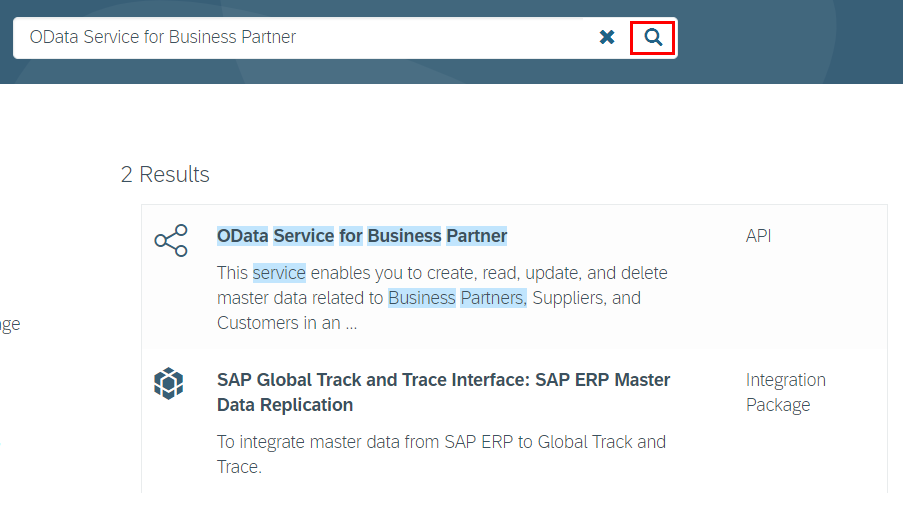
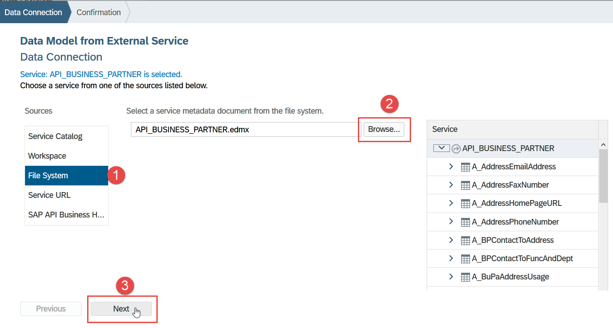
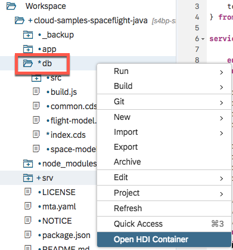
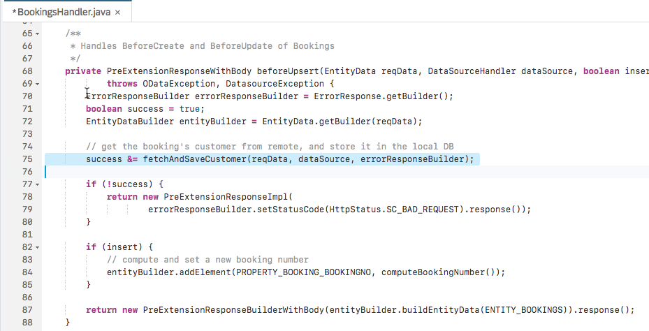
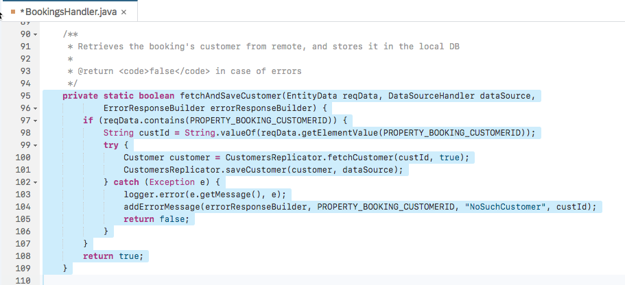
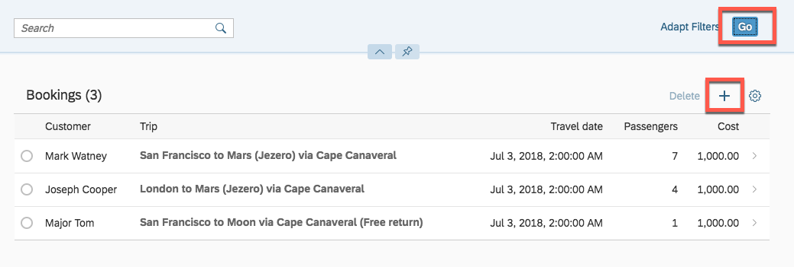
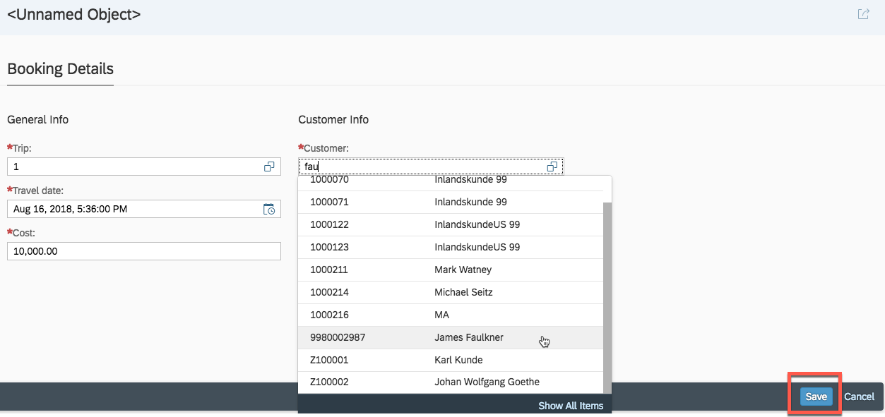
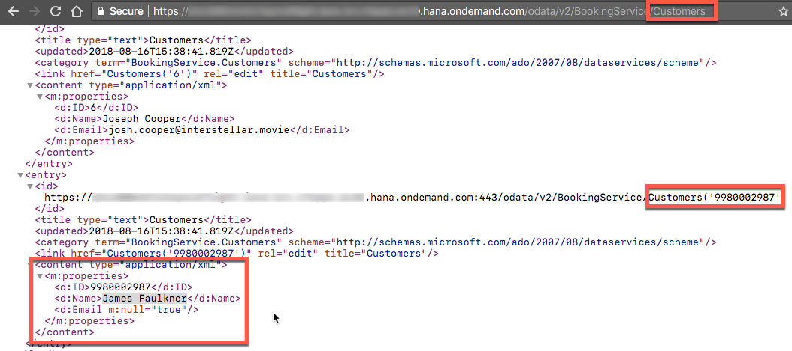

# Exercise 03: Connect an S/4HANA service (business partner)

## Estimated time

25 minutes

## Objective

In this exercise you'll learn how to add a remote service to your app which fetches customer data from an S/4 system. This data will be read once and then cached in your application database.

# Exercise description

## 1. Import S/4 HANA service

1. For this exercise you have to switch to another code branch of the cloned Github repository. In the Git pane, click the '+' icon to create a new local and link it to the desired remote branch. 

 

2. Select the branch names as shown in the picture:

 

3. Check the branch name in the file explorer

 

4. Find model of external service in SAP API Business Hub:  Navigate to SAP API Business Hub by opening the url https://api.sap.com/ in a separate browser tab or window. Select the "Log On" button and enter the credentials. In the search field type "OData Service for Business Partner" and press the search icon.

5. Select the first search result ("OData Service for Business Partner"). On the next screen switch to the "Details" view. Scroll down to select "Download Specification" and then select "EDMX"

 

Store this file to your local computer.

6. Import the service model into your project: Switch back to SAP Web IDE and import the file stored on your computer as an external service definition, by right-mouse-click on the ``srv`` folder, then selecting "New" -> "DataModel from External Service":  

7. In the wizard, import the previously stored file from your computer. Then press "Next".

8. Uncheck the box "Generate Virtua Data Model classes" and press "Finish":

9. Verify that the import has generated two servie definitions, one in xml format ("edmx"), the other in json format ("cson").

 

## 2. Incorporate external entities into data and service model

1. Remove comments in `db/index.cds`

2. Remove comments in `srv/booking-service.cds`

3. Deploy to the database

4. Browse the database

## 3. Change Java handler code: add S/4 calls

1. Adjust `CustomersRemoteHandler`: Change the line comments as indicated in the pictures.

2. Run

3. Browse

## 4. Show business partner
1. Adjust `BookingsHandler`

5. Run again

6. Adjust UI

7. Run UI

